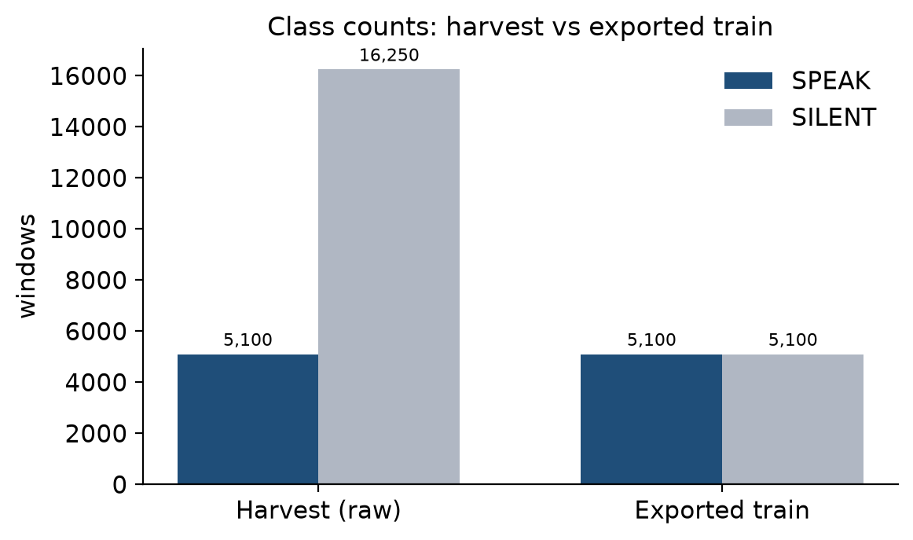
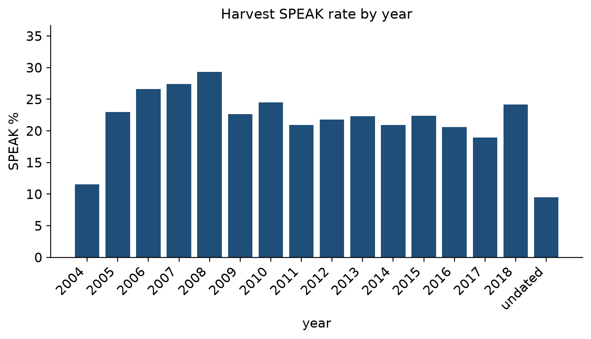
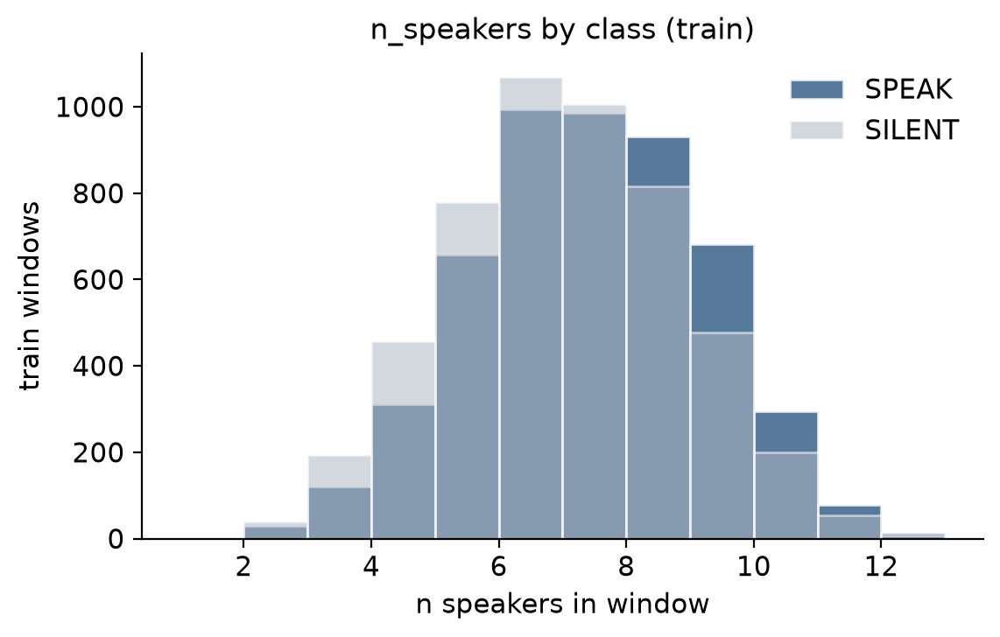
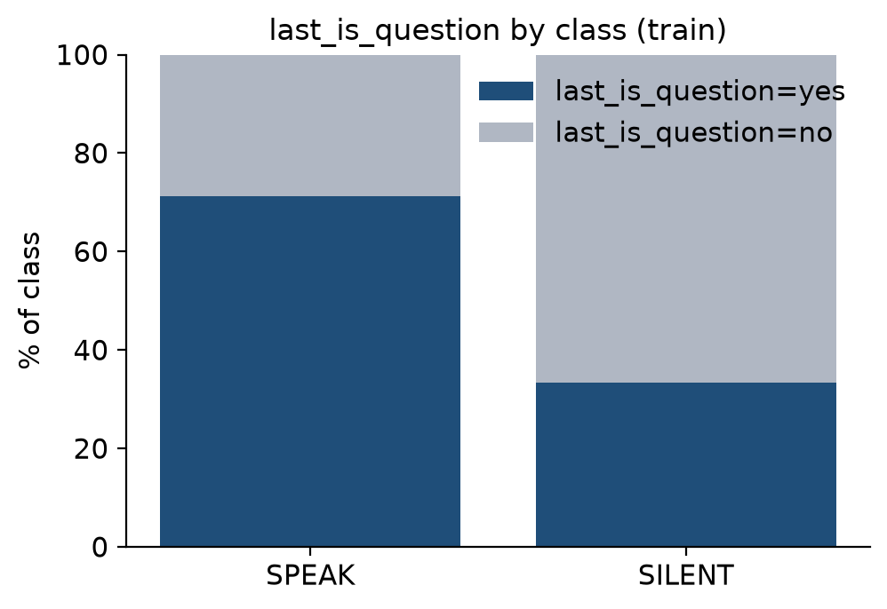
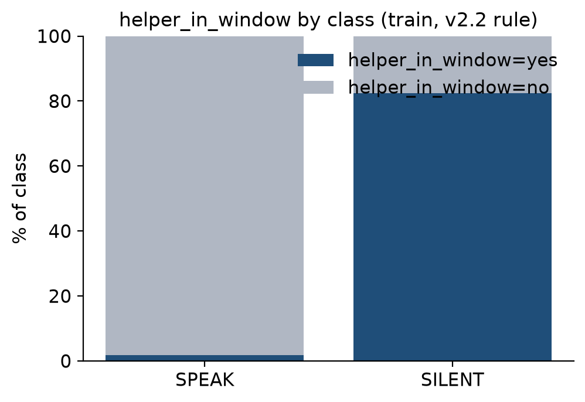
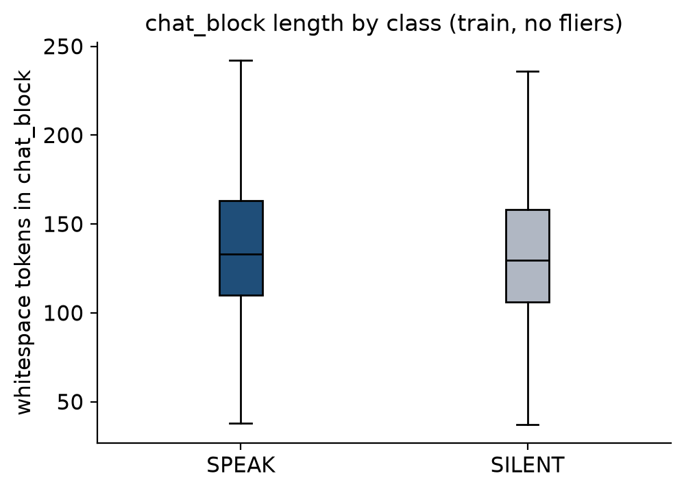

# SOMA v2.2 SPEAK|SILENT dataset

Paper-style datasheet. No LoRA. Teacher labels are Qwen2.5-32B-Instruct `pilot_v2.2`; test is Nivas gold. Seed=42. W=12.

## Abstract

1. Domain: multi-party Ubuntu IRC support (Kummerfeld et al., ACL 2019; jkkummerfeld/irc_disentangle only — not Lowe/McGill).
2. Unit: W=12 consecutive non-system lines; decision is whether an extra helper-bot should SPEAK or stay SILENT after the last line.
3. Teacher: Qwen2.5-32B-Instruct bf16 on Modal H100, transformers.generate, temperature 0, max_new_tokens=80, prompt_version=pilot_v2.2.
4. Gold: 200 Nivas-reviewed windows (audit_200). Never in train. Test SPEAK rate is the gold rate, not the teacher rate.
5. Harvest (teacher, unlabeled-pool prior): 5100 SPEAK + 16250 SILENT (23.9% SPEAK) from 21350 parse-ok windows.
6. Exported train is balanced 1:1: 5100 SPEAK + 5100 SILENT (SILENT downsampled from 16250 with seed=42, strata addressed/question/other).
7. Room vs train: natural teacher SPEAK rate is ~24%; train is 50% by construction — a class-balance shift, not a new room.
8. Known shift vs Nivas: teacher is quieter than gold on the 200 (Gate 1 v2.2 SPEAK 40.5% vs gold 45.0%; overall agree 85.5%). Table 3 flags ≥10 pp feature-rate gaps.
9. Input template always includes helper_in_window=yes/no from the v2.2 thread-scoped rule (recomputed at export; not a stored harvest column).
10. sft_dev is empty (friends later). Do not mix v1 silver. Do not overwrite Nivas gold.

## Table 1 — Dataset core

| item | value |
| --- | ---: |
| windows labeled (raw harvest, unique parse-ok) | 21350 |
| harvest SPEAK / SILENT | 5100 / 16250 |
| harvest SPEAK % | 23.9% |
| train (exported) | 10200 (5100 SPEAK + 5100 SILENT) |
| train SPEAK % | 50.0% |
| test (Nivas gold) | 200 (90 SPEAK + 110 SILENT) |
| test SPEAK % | 45.0% |
| original queue n / unlabeled proxy SPEAK % | 30000 / 23.9% (teacher prior on labeled pool) |
| chat_block tokens mean / p50 / p90 (train) | 136.9 / 132.0 / 192.0 |
| n_speakers mean / p50 / p90 (train) | 6.74 / 7.0 / 9.0 |
| years (ubuntu dated) | 2004–2018 |
| unique last_speakers (train) | 5561 |
| prompt_version / teacher | pilot_v2.2 / Qwen2.5-32B-Instruct bf16 H100 |
| source train / test | qwen32_v2.2 / nivas_gold |

Year histogram of the **harvest** pool (SPEAK % is teacher rate, not gold):

| year | n labeled | SPEAK % |
| --- | ---: | ---: |
| 2004 | 216 | 11.6 |
| 2005 | 2311 | 23.0 |
| 2006 | 3062 | 26.6 |
| 2007 | 2326 | 27.4 |
| 2008 | 2013 | 29.3 |
| 2009 | 1365 | 22.6 |
| 2010 | 1789 | 24.5 |
| 2011 | 1627 | 21.0 |
| 2012 | 1119 | 21.8 |
| 2013 | 2029 | 22.3 |
| 2014 | 813 | 20.9 |
| 2015 | 1229 | 22.4 |
| 2016 | 330 | 20.6 |
| 2017 | 782 | 18.9 |
| 2018 | 149 | 24.2 |
| undated | 190 | 9.5 |

## Table 2 — Split hygiene

| check | value |
| --- | ---: |
| id overlap train ∩ test | 0 |
| train ids in audit_200 | 0 |
| ubuntu vs channel_two (train) | 10133 / 67 |
| ubuntu vs channel_two (test) | 200 / 0 |
| ubuntu vs channel_two (harvest) | 21160 / 190 |
| test year range | 2004–2018 |
| train year range | 2004–2018 |
| test 2005 share | 13.5% |
| train 2005 share | 11.1% |

Year mix (do not hide a 2005-heavy test):

| year | train n | test n |
| --- | ---: | ---: |
| 2004 | 85 | 3 |
| 2005 | 1131 | 27 |
| 2006 | 1527 | 23 |
| 2007 | 1175 | 22 |
| 2008 | 1015 | 19 |
| 2009 | 608 | 18 |
| 2010 | 850 | 10 |
| 2011 | 772 | 13 |
| 2012 | 522 | 9 |
| 2013 | 942 | 21 |
| 2014 | 381 | 6 |
| 2015 | 549 | 14 |
| 2016 | 147 | 3 |
| 2017 | 347 | 11 |
| 2018 | 82 | 1 |
| undated | 67 | 0 |

Overlap assert: **0**. Job fails if this is not 0. Test is not 2005-heavy (13.5% of test vs 11.1% of train).

## Table 3 — Label × features (train Qwen vs test Nivas)

`helper_in_window` is always the v2.2 rule (recomputed; not stored as a harvest column).

| slice | n | question % | addressed % | thanks % | helper_in_window % | n_speakers mean |
| --- | ---: | ---: | ---: | ---: | ---: | ---: |
| train SPEAK | 5100 | 71.3 | 7.4 | 0.6 | 1.8 | 6.9 |
| train SILENT | 5100 | 33.3 | 49.8 | 3 | 82.4 | 6.5 |
| test SPEAK | 90 | 65.6 | 6.7 | 0.0 | 16.7 | 6.8 |
| test SILENT | 110 | 29.1 | 31.8 | 9.1 | 76.4 | 6.1 |

DATASET SHIFT flagged (train Qwen vs test Nivas, |Δ| ≥ 10 pp):

| class | feature | train % | test % | Δ pp |
| --- | ---: | ---: | ---: | ---: |
| SPEAK | helper_in_window_pct | 1.8 | 16.7 | 14.9 |
| SILENT | addressed_to_nonempty_pct | 49.8 | 31.8 | -18 |

How to read the flags: (1) Train SPEAK is almost never `helper_in_window=yes` (1.8%) because v2.2's teacher rule is SILENT when a helper is already on that thread; Nivas gold SPEAK still includes 16.7% helper-present windows — policy disagreement, not a year bug. (2) Train SILENT `addressed_to` is inflated (49.8% vs test 31.8%) because SILENT was downsampled to 1/3 addressed + 1/3 question + 1/3 other; question rows can also be addressed. Question rate on SPEAK is close (train 71.3% vs test 65.6%) — not flagged.

## Table 4 — Class-balance variants we can train

| variant | SPEAK | SILENT | n | SPEAK % | status |
| --- | ---: | ---: | ---: | ---: | ---: |
| 1:1 (exported train) | 5100 | 5100 | 10200 | 50.0% | sft_train.jsonl |
| 1:3 | 5100 | 15300 | 20400 | 25.0% | possible; not exported |
| natural harvest | 5100 | 16250 | 21350 | 23.9% | labeled pool prior |

sft_dev.jsonl is a 0-row placeholder (`# friends later`).

## Figures

1. Class counts harvest vs train



2. Harvest SPEAK rate by year



3. n_speakers histogram by class (train)



4. last_is_question stacked by class (train)



5. helper_in_window stacked by class (train)



6. chat_block token-length boxplot by class (train)



## Qualitative examples

Last line plus three context lines. Not cherry-picked beyond seed=42 within class.

### Train SPEAK (Qwen v2.2)

**`ubuntu:train:2010-01-04:82:0:126325`** — SPEAK
helper_in_window=no question=False addressed_to=∅
```
ondra: kinja-sheep, I've got it installed, but that god damn thing is still not working
lowki: biznock09: use rm
bitplane: Halvor, go to a command line and try running one of the apps from there
lucas_: LG X110 WEBCAM NOT
```

**`ubuntu:train:2006-09-24:41:0:62385`** — SPEAK
helper_in_window=no question=True addressed_to=∅
```
new2linx: yes
Telroth_Plushie|: any help for me?
admin_: hmm, becuase i keep trying to boot xubuntu on an old imac, and after it loads, and then when X is supposed to start, the screen shits off
THX-1138: Bacuruda - Did that help?
```

**`ubuntu:train:2005-12-23:18:0:26313`** — SPEAK
helper_in_window=no question=True addressed_to=∅
```
soundray: izi_, /var/log/syslog
soundray: izi_, e.g. grep wpa /var/log/syslog
CaptainMorgan: any folks familiar with Emacs ? i can't get bold font to stay saved after a reloading of the program... but I can keep the fontstyle... ??
lacking: Ok whats the best P2P mp3 software and yes please make it illegal?
```

**`ubuntu:train:2007-01-29:49:0:74654`** — SPEAK
helper_in_window=no question=True addressed_to=∅
```
whonicca: has anybody gotten videos on zhare.net to work?
stepanstas: xtknight, is that what you want
xtknight: worldedit: then you should have 32bit firefox as far as i know
black_13_: how do i view tiff images embedded in a web page?
```

### Train SILENT (Qwen v2.2)

**`ubuntu:train:2011-04-14:97:0:148495`** — SILENT
helper_in_window=yes question=False addressed_to=Ben64
```
edbian: pfifo: if admin is a group then in /etc/sudoers you need %admin ALL=(ALL) ALL
edbian: a percent sign is needed for groups
Ben64: edbian: nice catch, i didn't notice the missing %
edbian: Ben64: :)
```

**`ubuntu:train:2005-05-19:5:0:8033`** — SILENT
helper_in_window=yes question=False addressed_to=∅
```
cbruggeman: ok bob2
cbruggeman: my problem is juste than i didn't arrive to install spip
ali4728: <bob2> it hangs..
jsgotangco: mole_, that's great, refer to http://udu.wiki.ubuntu.com/PDASupport
```

**`ubuntu:train:2008-03-01:67:0:103026`** — SILENT
helper_in_window=yes question=False addressed_to=dangermike
```
nickrud: Long: alt f9 iirc
bl3u: dangermike: i do indeed have linux-restricted-modules-2.6.22-14-generic installed
sweetsinse: how can i force install and older version deb package
bl3u: dangermike: and yet modprobe -l |grep ath_pci returns nothing
```

**`ubuntu:train:2013-10-04:126:0:186389`** — SILENT
helper_in_window=yes question=False addressed_to=Dr_Willis
```
ezra-s: ActionParsnip, I know, but it is the same as "which distro is best for..." question, so best reply is to look at the #channel you are in and reply
Dr_Willis: we all know Minix is best ;P
ActionParsnip: ezra-s: i tend to ignore channel, and advise on needs. There were no needs specified so there is no best
ActionParsnip: Dr_Willis: ha
```

### Test gold (Nivas) vs v2.2 teacher on the same 200

**`ubuntu:train:2007-06-01:53:0:81409`** — SPEAK
helper_in_window=yes question=True addressed_to=∅
Nivas=SPEAK  v2.2=SILENT  (DISAGREE)
```
johnschroeder: sipior: oh i see, all i did was download the ubuntu server, and what your saying is i should have download everything?
tobyb: is having an XP disk image a good recovery safeguard in case I botch my Ubuntu dual-boot install attempt? can i restore the image and thus wipe out grub in my MBR?
lusepuster: ikonia: yes, but it isn't any hardware thing, that's what I mean
djieno: leagris, what is the tool?
```

**`ubuntu:validation:2011-11-13:8:0:11093`** — SPEAK
helper_in_window=no question=True addressed_to=∅
Nivas=SPEAK  v2.2=SPEAK  (agree)
```
altice: yep, with ya pfifo
Rya_n: How can I make the icon text narrower, or get rid of it altogether?
L1nuxRules: pfifo also dont advise people to advise people stuff above them
puff: Can somebody help me with my disappearing sound?
```

**`ubuntu:train:2004-12-25:0:0:603`** — SILENT
helper_in_window=no question=False addressed_to=∅
Nivas=SILENT  v2.2=SPEAK  (DISAGREE)
```
oscarh: sorry, new to gnome
seb128: you don't
oscarh: seb, wonderfull
seb128: that's been rewritten; that's a devel branch
```

**`ubuntu:train:2010-02-13:83:0:127679`** — SILENT
helper_in_window=yes question=False addressed_to=Flannel
Nivas=SILENT  v2.2=SILENT  (agree)
```
ax: Flannel: yeah
ax: radeon
Sh3r1ff: Flannel: he has 8.04 for the moment
sebsebseb: Flannel:  yeah seems I didn't put in the bit about 8.04 to 10.04 works hrm
```

## Leak / quality checks

| check | value |
| --- | ---: |
| duplicate chat_block in train | 0 |
| windows sharing a duplicated chat_block | 0 |
| last_line types with count≥5 (train) | 0 |
| most-repeated last_line count | 3 |
| empty chat_block train | 0 |
| parse-fail harvest windows | 1 |
| documented parse-fail id | ubuntu:train:2011-08-22:101:0:154432 |
| train ∩ audit_200 | 0 |
| train ∩ used_window_ids.txt | 820 |
| train input missing helper_in_window= | 0 |
| v1 rows in train | 0 |
| gold field overwritten on audit_200 | no — export reads label_gold only |

The one harvest parse fail is a teacher JSON escape (`helper \l …`), not a missing window in gold. `used_window_ids.txt` is the v1 2k freeze plus audit ids. Train ∩ that file is **re-labeled v2.2 windows from the 2k**, not test leakage. The hygiene number is train ∩ audit_200 = 0.

## Files

- `data/processed/sft_train.jsonl` n=10200
- `data/processed/sft_test.jsonl` n=200
- `data/processed/sft_dev.jsonl` n=0 (`# friends later`)
- `data/silver/train_10k_ids.txt` n=10200 (name is historical; freeze is 5100+5100)
- `data/silver/pilot_v2_2_labels.jsonl` harvest dump
