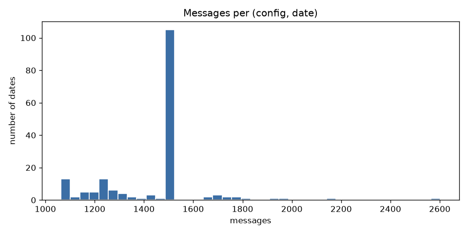
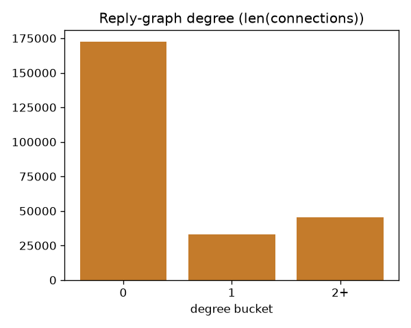
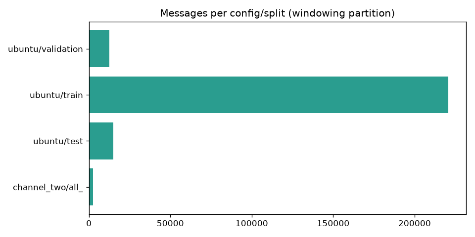

# EDA — jkkummerfeld/irc_disentangle (multi-party stream)

Generated (UTC): 2026-08-28T13:13:31.056105+00:00
Seed: 42. GAP_THRESHOLD=5. W=12.

## Headline counts

- parsed messages (windowing partition): **250,738**
- system JOIN/PART/QUIT/NICK/…: **10.32%** (25,866)
- `/me` actions (kept in windows): **0.53%** (1,334)
- questions (`?` in text): **19.98%** (50,094)
- addressed (`Nick:` prefix): **26.65%** (66,828)
- parse failures: **0.071%** (178)
- nonempty `connections` (annotated-ish): **78,250**

### Messages per split

| split | n |
|---|---:|
| channel_two/all_ | 2,602 |
| ubuntu/test | 15,010 |
| ubuntu/train | 220,616 |
| ubuntu/validation | 12,510 |

### Messages per date

- n date-keys: 174
- p50=1501, p90=1501, min=1063, max=2602

### Unique nicks per day (non-system speakers)

- p50=131.5, p90=171.7

### connections degree

| degree | n |
|---|---:|
| 0 | 172,488 |
| 1 | 32,877 |
| 2+ | 45,373 |

## Are ids contiguous or sampled slices?

GAP_THRESHOLD=5 (new run iff id[t]-id[t-1] > 5). Kummerfeld 2019 samples 173 time slices of #ubuntu; ids are log-line numbers inside each file. Same-calendar-day files concatenated on the Hub reset id to 0 (new slice). Tiny holes (1–5) stay in-run so JOIN bursts we later drop do not shatter a real conversation. Jumps of 6+ are treated as a new run so we never glue two distant samples into one fake room.

- date-slices: 174
- fully contiguous slices (diff==1 throughout): 174 (100.0%)
- gaps with step > 5: 0
- max missing ids in a step: 0
- gap size p50/p90/p99: 0 / 0 / 0
- extra slices from id-reset on the same date: 0

Empirical result on this Hub dump: every `(config, split, date, slice)` is **fully
contiguous** (id step == 1). The 173 Kummerfeld time-slices show up as **different
calendar dates** (plus channel_two `undated`), not as holes inside a date.
`GAP_THRESHOLD=5` is a safety belt; it did not split any run here.
- runs per slice p50/p90: 1.0 / 1.0

Windows **never** jump a run, date, slice, split, or config.

### Example large gaps

- (none)

## Clock vs official (date, id) order

Official order is always `(config, split, date, slice_id, original_id)`.
If the `[HH:MM]` clock goes backwards we still trust that key.
Early Ubuntu irclogs (c. 2004–2007) use a **12-hour** clock without AM/PM
(`12:59` → `01:00` is one minute, not 12 hours). Later years are 24-hour
(`23:59` → `00:00`). `time_capped_n` uses a 12h-or-24h wrap heuristic.

- midnight wraps (23:xx → 00:xx): 25
- non-wrap backwards (flagged anomalies): 0

### wrap examples

- ubuntu/test 2013-09-01 id 8303->8304 23:58->00:02
- ubuntu/test 2015-03-18 id 10949->10950 23:59->00:00
- ubuntu/test 2016-06-08 id 13892->13893 23:59->00:00
- ubuntu/train 2007-08-19 id 88050->88051 12:59->01:00
- ubuntu/train 2008-07-03 id 113392->113393 23:59->00:00
- ubuntu/train 2010-02-13 id 127646->127647 23:59->00:00
- ubuntu/train 2011-04-14 id 147683->147684 23:59->00:00
- ubuntu/train 2011-12-07 id 156675->156676 23:59->00:00

### anomaly examples

- (none)

## Sample raw lines

### question (n=15)

- `[09:14] <intinig> does a subversion gnome client exist?`
- `[12:18] <tweaked> HrdwrBoB: ok how many partitions should i make?`
- `[09:14] <kleedrac> crimsun: Hmmm ... I wonder why it does that?`
- `[11:11] <IceDC571> why cant you just buy the full quality dvd from a shop?`
- `[12:18] <Matt|> epod, ftp in the my computer window huh?`
- `[11:12] <Edulix> IceDC571: are you really doing that question ? maybe becuase it's not cheap ?`
- `[12:19] <|trey|> billytwowilly, you have the kernel source or kernel-headers packages?`
- `[11:13] <IceDC571> Amaranth: would libdvdcss2 be illegal in the US?`
- `[09:17] <intinig> what should I use then?`
- `[12:20] <tweaked> HrdwrBoB: How amny should i make?`
- `[09:17] <|QuaD-> kleedrac: is ogg open source?`
- `[12:20] <Matt|> what is gnome 2.9 like?`
- `[12:21] <billytwowilly> hmm. I have kernel 2.6.8.1 but synaptec wants to install 2.6.7 headers?`
- `[11:14] <cikilin> can anybody help me see a dvd on linux?`
- `[11:14] <IceDC571> so how do I view dvds in linux legally? pshh..`

### address (n=15)

- `[09:14] <crimsun> kleedrac: I'm afraid not. Any version of mplayer except for -k7* should work for your cpu`
- `[09:15] <|QuaD-> will: totem has caused me no troubles`
- `[09:15] <crimsun> kleedrac: good question.`
- `[11:12] <Edulix> IceDC571: that's his business :P`
- `[09:15] <crimsun> intinig: I don't see one in warty or hoary`
- `[09:16] <|QuaD-> kleedrac: heh.. never needed a wma file played`
- `[09:16] <crimsun> intinig: however, there's always gsvn, as in http://gsvn.tigris.org/`
- `[09:16] <kleedrac> Quad: consider yourself lucky :) worse quality than mp3 ... wish she'd learn to use oggenc that's why I installed it :)`
- `[09:17] <crimsun> intinig: that project, however, seems deprecated.`
- `[09:17] <kleedrac> Quad: absolutely`
- `[09:17] <|QuaD-> kleedrac: :)`
- `[11:15] <Amaranth> IceDC571: You pay $30 for this program that only works on one version of one distro.`
- `[12:21] <bob2> billytwowilly: install linux-headers-2.6.8.1-3-686`
- `[11:15] <IceDC571> Amaranth: whats that?`
- `[09:18] <kleedrac> Quad: http://www.vorbis.com/`

### system (n=15)

- `=== L0sT [~waa3@raptor.ukc.ac.uk]  has joined #ubuntu`
- `=== topyli [~juha@dsl-hkigw3k9b.dial.inet.fi]  has left #ubuntu []`
- `=== vassie [~vassie@195.153.177.75]  has joined #ubuntu`
- `=== `anthony [~anthony@213.151.107.243]  has joined #ubuntu`
- `=== nitroXL [~tekkno@BSN-77-45-12.dsl.siol.net]  has joined #ubuntu`
- `=== tuxx [~tuxx@0x50a5a424.kd4nxx17.adsl-dhcp.tele.dk]  has joined #ubuntu`
- `=== spiv [~andrew@213.151.107.243]  has joined #ubuntu`
- `=== karlheg [~karlheg@host-250-237.resnet.pdx.edu]  has joined #ubuntu`
- `=== hannes_ [hannes@dna251-74.satp.customers.dnainternet.fi]  has joined #ubuntu`
- `=== Crushed_Cigar [~zinc@ACC4B514.ipt.aol.com]  has joined #ubuntu`
- `=== sid77 [~sid77@151.11.187.66]  has joined #ubuntu`
- `=== mwe [~mwe@port462.ds1-ynoe.adsl.cybercity.dk]  has joined #ubuntu`
- `=== karlheg [~karlheg@host-250-237.resnet.pdx.edu]  has joined #ubuntu`
- `=== Sionide [~sphinx@cpc4-hem12-6-0-cust227.lutn.cable.ntl.com]  has joined #ubuntu`
- `=== bugz_ [~vanni@61.9.24.27]  has joined #ubuntu`

### normal (n=15)

- `[11:11] <Seveas> Amaranth, the US peer is probably breaking the law`
- `[12:18] <|trey|> usual, quite stable though  :)`
- `[11:11] <Seveas> but an ES or NL peer downloading it not`
- `[11:11] <monchichi> http://www.msnbc.msn.com/id/8419601/`
- `[12:18] <Matt|> |trey|, top in the list --> ubuntu servers`
- `[11:11] <IceDC571> the US peer is just stupid for wanting to share movies in the first place`
- `[09:15] <will> best media player: VLC /get wxvlc) It plays everything!`
- `[12:18] <usual> a few libs and media`
- `[11:11] <Seveas> The downloader is breaking the implicit rules of good netizenship though :)`
- `[12:18] <usual> maybe some others`
- `[09:15] <|QuaD-> totem xine`
- `[11:12] <Amaranth> i buy my music off iTunes (support the artists, easier) and watch movies in the theater (their entertainment system is nicer than mine)`
- `[12:18] <epod> Matt|, command prompt`
- `[09:15] <Tsjoklate> |QuaD same here.. totem-xine werkt geweldig`
- `[12:18] <Matt|> epod, oh k`

### action (/me) (n=15)

- `=== jiyuu0 here to witness...`
- `=== Amaranth only knows about the DVDCCA because they sued a friend over DeCSS`
- `=== sid77 hi`
- `=== Matt| scrolls up`
- `=== ogra recognizes the first attendees for the conference on the wiki :))`
- `=== Amaranth really needs to stop helping people with ubuntu problems from a windows machine`
- `=== |trey| is starting to think the Wiki is evil... he gets sucked into it way too easily  :o`
- `=== Amaranth heads for bed`
- `=== |trey| shuts up`
- `=== |trey| usually plays sports games or fighting games... adhd isn't kind when trying to play rpg's  :(`
- `=== ogra thinks regarding this chat ther may be too much deb in ubuntu`
- `=== |trey| is trying to catch up`
- `=== Tsjoklate changes subject`
- `=== Tsjoklate nods at |QuaD`
- `=== |trey| isn't the biggest fan of xine ever  :(`

## Figures

