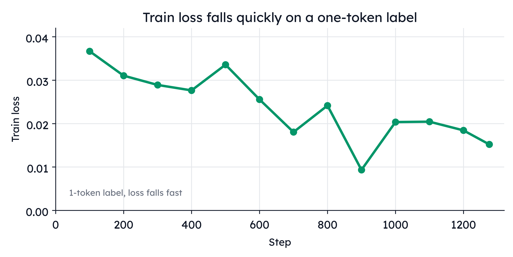
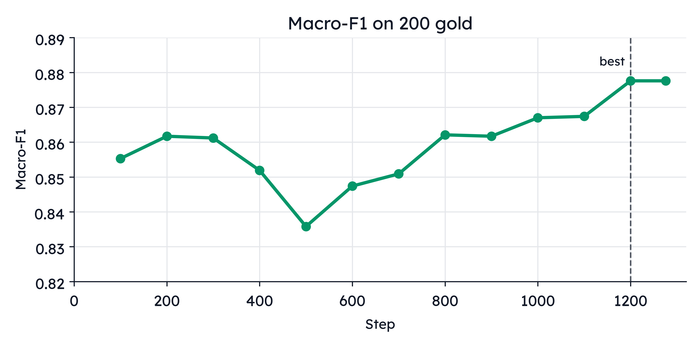
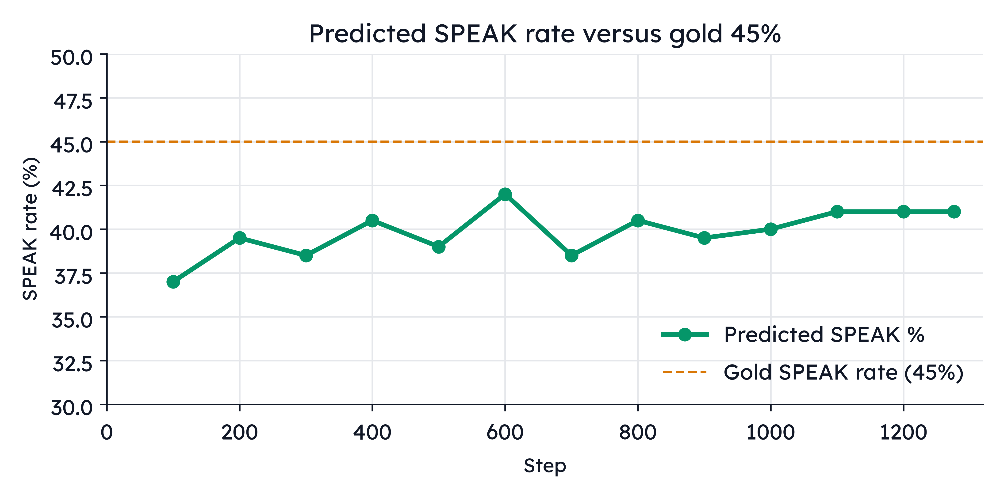
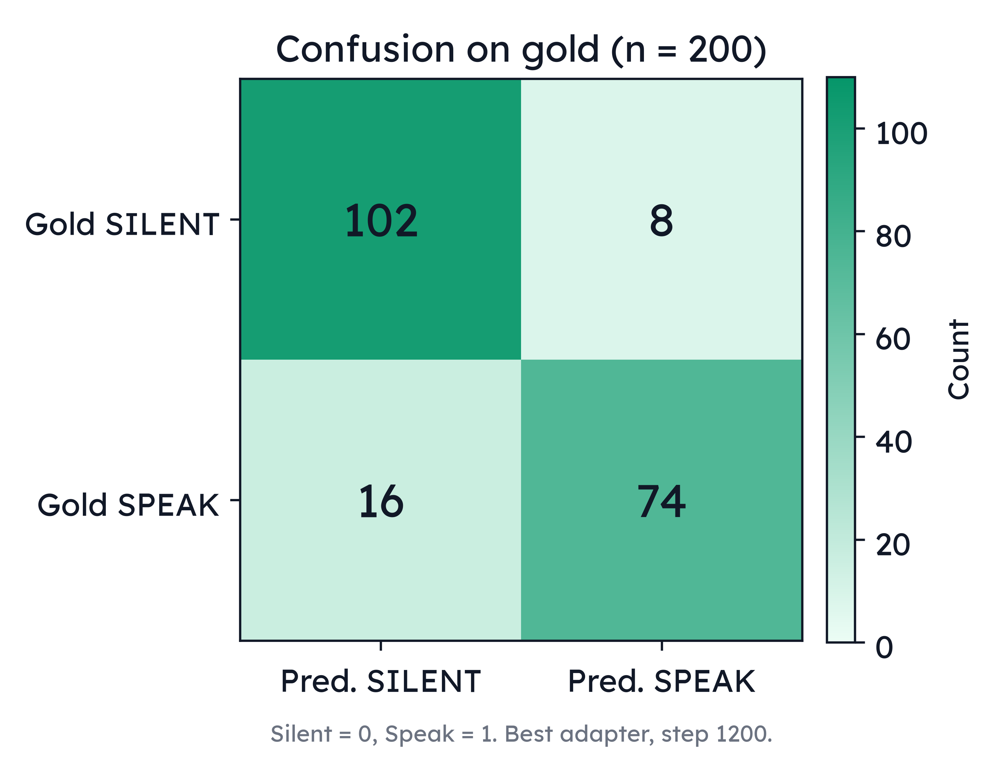
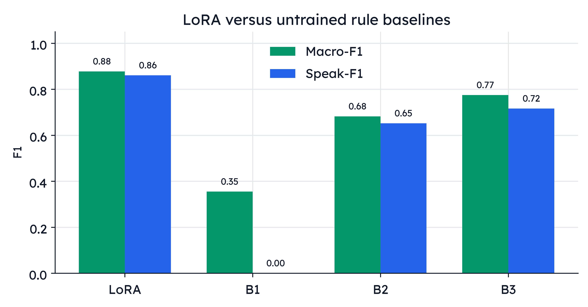
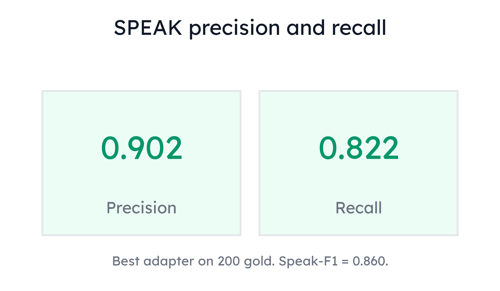

# Training and evaluation — SOMA gate LoRA 7B

No retraining. Numbers from `reports/lora_run/reports/` (`train_metrics.jsonl`, `test_metrics.json`, `test_confusion.md`, `test_200_predictions.csv`) and `reports/train_plan.md`. Best adapter = **highest Macro-F1 on 200 gold**, step **1200**.

Figures: `reports/figures/train_eval/`.

---

## 1. Setup

| | |
| --- | --- |
| Base | `Qwen/Qwen2.5-7B-Instruct` rev `a09a35458c702b33eeacc393d103063234e8bc28` |
| Adapter | LoRA **r=16**, **α=32**, dropout **0.05** on q/k/v/o + gate/up/down |
| Optim | lr **2e-4** cosine, warmup 0.03, **2 epochs**, seed 42 |
| Batch | per-device 8, accum 4 → **effective 32** |
| Length | `max_length=1024`, packing **False** |
| Loss | TRL SFT, `completion_only_loss=True` |
| Train | `data/processed/sft_train_1to3.jsonl` **20,400** (5,100 SPEAK / 15,300 SILENT), source `qwen32_v2.2` |
| Test | `data/processed/sft_test.jsonl` **200 gold** (90 SPEAK / 110 SILENT) |
| Hardware | Modal **H100** 80GB bf16, ~**58 min** (eval every 100 steps on 200 gold) |
| Stack | transformers 5.16.1, TRL 1.12.0, PEFT 0.20.0 (`reports/train_plan.md`) |

Baselines are **untrained rules** on flags already in `input` (`modal_lora.py` `_baselines`):

- **B1** always SILENT
- **B2** SPEAK iff `question=yes`
- **B3** SPEAK iff `question=yes` **and** `helper_in_window=no`

---

## 2. What is optimized

The completion is the single token **`SPEAK` or `SILENT`**. The 12-line window sits in the prompt; loss is **not** on the chat, only on that label (`completion_only_loss`). That is why train loss is already ~0.037 at step 100 and stays small: there is almost nothing to predict besides one class token.

Selection is **not** min train loss. Checkpoint = max **Macro-F1** on the 200 gold.

---

## 3. Training log

Jsonl schema (13 rows, steps 100…1200 then last **1276**): `step`, `epoch`, `eval_loss`, `train_loss`, `macro_f1`, `speak_p/r/f1`, `silent_p/r/f1`, `speak_rate`, `gold_speak_rate` (always 0.45), `tn/fp/fn/tp`.

| step | epoch | train_loss | eval_loss | macro-F1 | speak-F1 | silent-F1 | pred SPEAK% |
| ---: | ---: | ---: | ---: | ---: | ---: | ---: | ---: |
| 100 | 0.16 | 0.0367 | 0.1708 | 0.8553 | 0.8293 | 0.8814 | 37.0 |
| 200 | 0.31 | 0.0310 | 0.1519 | 0.8617 | 0.8402 | 0.8831 | 39.5 |
| 300 | 0.47 | 0.0289 | 0.1329 | 0.8612 | 0.8383 | 0.8841 | 38.5 |
| 400 | 0.63 | 0.0276 | 0.1820 | 0.8519 | 0.8304 | 0.8734 | 40.5 |
| 500 | 0.78 | 0.0336 | 0.1178 | 0.8358 | 0.8095 | 0.8621 | 39.0 |
| 600 | 0.94 | 0.0256 | 0.1699 | 0.8474 | 0.8276 | 0.8673 | 42.0 |
| 700 | 1.10 | 0.0180 | 0.1555 | 0.8509 | 0.8263 | 0.8755 | 38.5 |
| 800 | 1.25 | 0.0241 | 0.1528 | 0.8621 | 0.8421 | 0.8821 | 40.5 |
| 900 | 1.41 | 0.0093 | 0.1468 | 0.8617 | 0.8402 | 0.8831 | 39.5 |
| 1000 | 1.57 | 0.0203 | 0.1278 | 0.8670 | 0.8471 | 0.8870 | 40.0 |
| 1100 | 1.72 | 0.0204 | 0.1548 | 0.8674 | 0.8488 | 0.8860 | 41.0 |
| **1200** | **1.88** | 0.0184 | 0.1435 | **0.8776** | **0.8605** | **0.8947** | **41.0** |
| 1276 | 2.00 | 0.0152 | 0.1426 | 0.8776 | 0.8605 | 0.8947 | 41.0 |

**Best = 1200** (first time Macro-F1 hits 0.8776). Last step **1276** matches the same F1 and the same confusion; we still keep 1200 as the selected adapter. Predicted SPEAK% stays **below** gold 45% (quiet teacher prior).

*Figure A. Train loss on the SPEAK/SILENT completion. One-token target; loss is already low by step 100.*

*Figure B. Macro-F1 on 200 gold. Dashed line = selected checkpoint (step 1200).*

*Figure C. Predicted SPEAK rate versus the gold rate 45%. The student stays quieter (~41%).*

---

## 4. Final test versus B1 / B2 / B3

Best adapter, n=200. Mapping: Silent=0, Speak=1.  
TN = gold SILENT pred SILENT. FP = gold SILENT pred SPEAK. FN = gold SPEAK pred SILENT. TP = gold SPEAK pred SPEAK.

| method | macro-F1 | speak-F1 | silent-F1 | SPEAK% | TN | FP | FN | TP |
| --- | ---: | ---: | ---: | ---: | ---: | ---: | ---: | ---: |
| **LoRA (step 1200)** | **0.8776** | **0.8605** | **0.8947** | 41.0 | **102** | **8** | **16** | **74** |
| B1 always SILENT | 0.3548 | 0.0000 | 0.7097 | 0.0 | 110 | 0 | 90 | 0 |
| B2 `question=yes` | 0.6821 | 0.6519 | 0.7123 | 45.5 | 78 | 32 | 31 | 59 |
| B3 question and no helper | 0.7748 | 0.7162 | 0.8333 | 29.0 | 105 | 5 | 37 | 53 |

LoRA 176/200 = 88% accuracy. Macro-F1 **0.8776 ≥ B3 0.7748** → allowed to claim a win vs the strongest rule. SPEAK P=0.902, R=0.822.

*Figure D. LoRA confusion on gold (n = 200). Errors are mostly FN (16 missed SPEAK), not FP (8 extra SPEAK).*

*Figure E. Macro-F1 and Speak-F1 for LoRA versus untrained B1–B3.*

*Figure F. SPEAK precision 0.902 and recall 0.822 on the 200 gold.*

---

## 5. Reading the errors

From `test_200_predictions.csv` (best adapter):

| | n | `helper_in_window=yes` | `question=yes` |
| --- | ---: | ---: | ---: |
| FN (gold SPEAK, pred SILENT) | **16** | **13 / 16** | 7 / 16 |
| FP (gold SILENT, pred SPEAK) | 8 | 0 / 8 | 3 / 8 |
| Gold SPEAK total | 90 | 15 | — |

**13 of 16 misses are helper-present SPEAK gold.** That matches the dataset shift: v2.2 teacher almost never SPEAKs when `helper_in_window=yes` (train SPEAK helper rate 1.8% vs gold 16.7%). The student copied the quiet teacher. FP is the opposite: all 8 extra SPEAKs have helper=no.

B3 is even more silent (FN=37). LoRA recovers some open questions without flooding (FP only 8 vs B2’s 32).

---

## 6. What we did not train

- **1:1 LoRA** (`sft_train_1to1.jsonl` exists; no run)
- Full fine-tune or LoRA on **32B**
- A **writer** (reply generation)
- Emotion / MiniLM / ToM / PPO / GRPO
- Training on gold (test only)
- Mixing v1 silver into train

The 7B is a **distillation of the v2.2 32B teacher** onto a SPEAK|SILENT token, evaluated on 200 human gold rows.
